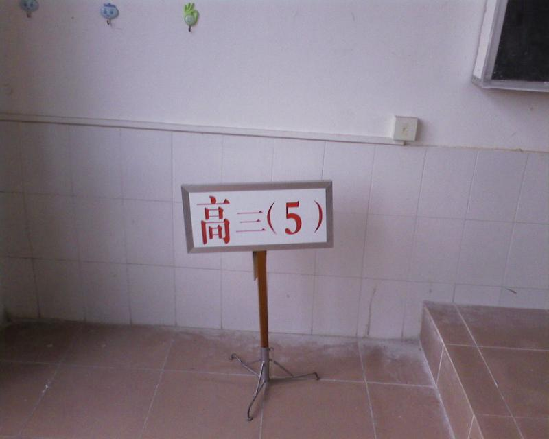
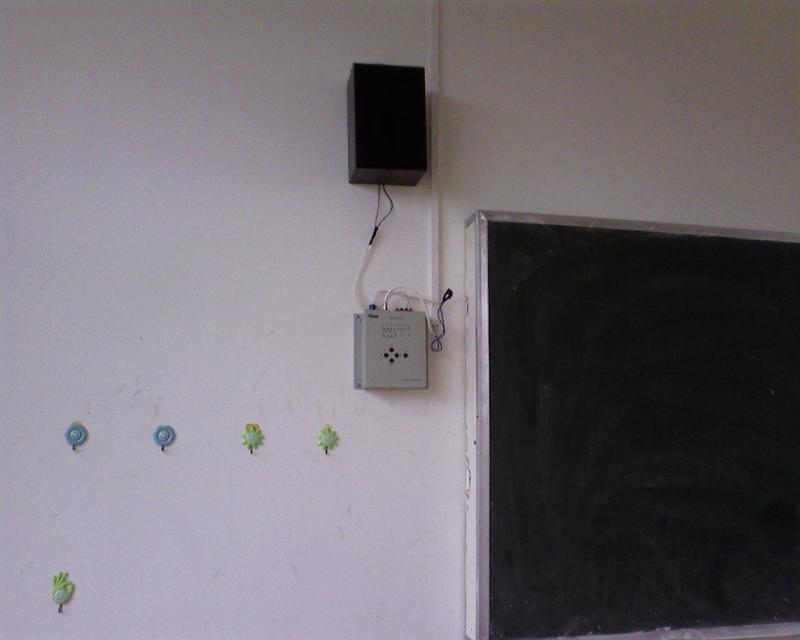

上次去转团，正好遇到高一开学，所以就来了个故地重游，参观了一下以前的教室。

以前的教室依然给 5 班占领着，据说也是实验班尖子班或者重点班，里边好像很多全 A+的（T_T，当年这么算的话，我还不是全 A 呢），我们教室的主人——却是可爱的政治老师，高二时候的名言「牵牛要牵牛鼻子，好刀用在钢刃上」我至今还记得呢。

他也认为我是要去开飞机了——直接无视——还说要请我介绍经验，不过到现在似乎已经打消了念头。

转了一圈，没发现贴着复旦来历的纸的我的桌子，。希望不是给直接撕掉了，那个东西虽然没助我进入复旦，但还是有点鞭策作用的。许多课桌的贴纸也全不见了，真的很可惜。

唯一拍到的，是班牌，应该是挺有纪念价值的照片啊

P.S.这个是看到别人空间里边写的，才有感而发的
