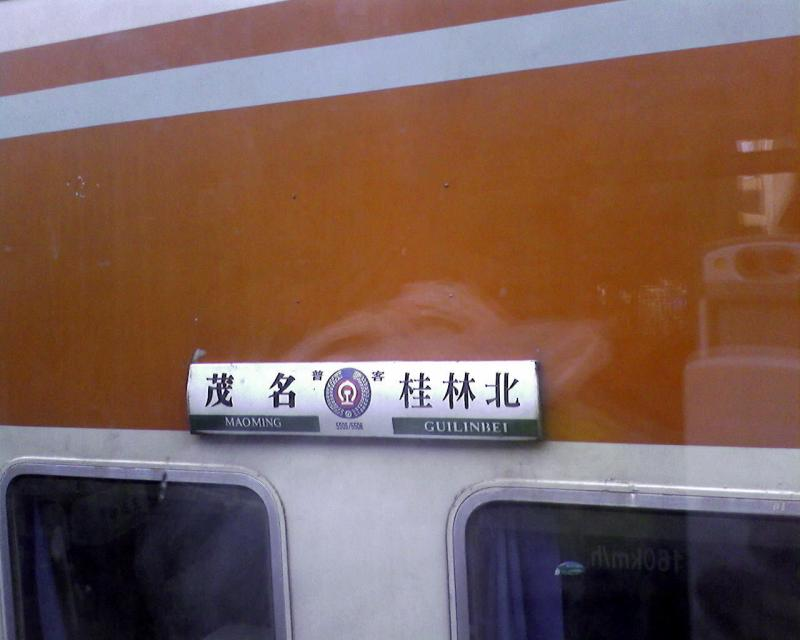

挂在火车车身上的，不错吧……
就是可惜没拍到我坐的那辆

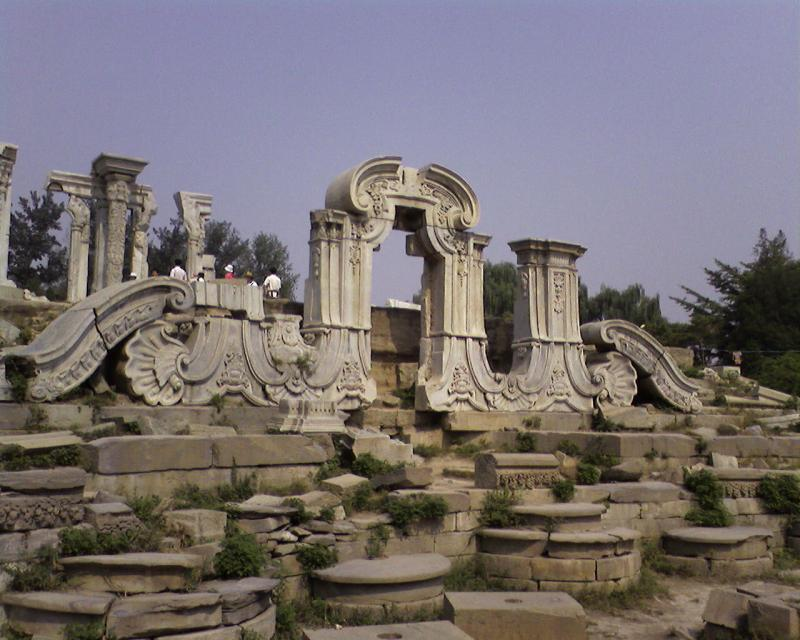
圆明园，大家比较熟悉的一个地点……

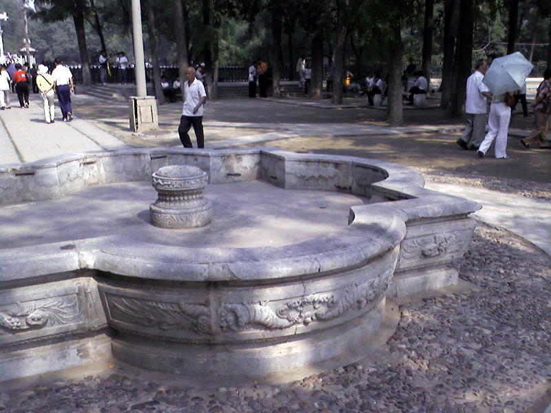
水池子，就是不记得名字了

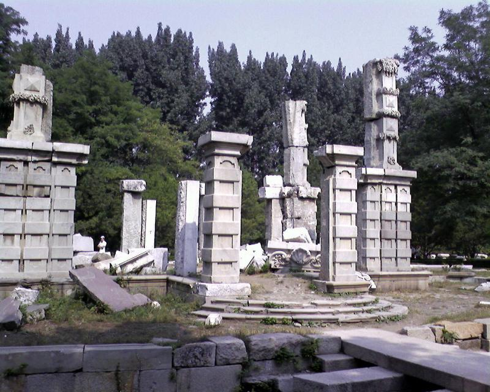
圆明园废墟的一部分，可以想象以前的豪华
只可惜我们只是走马观花，而大部分的地方都已过度商业化

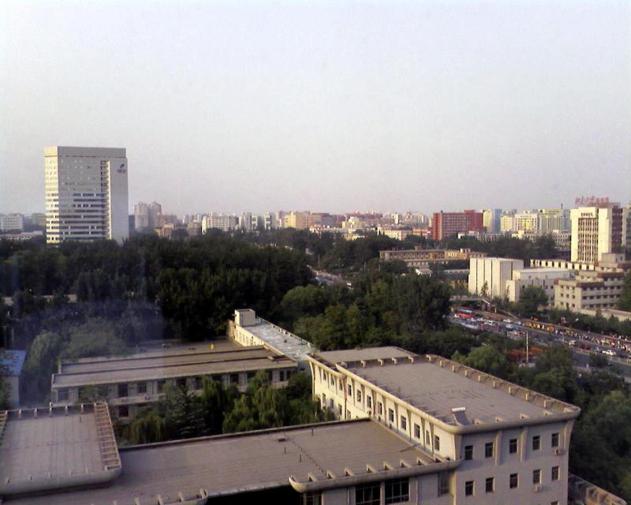
站在北航的新主楼往下望看到的

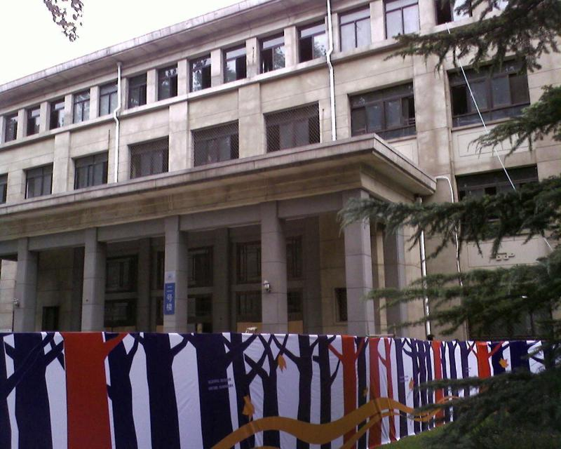

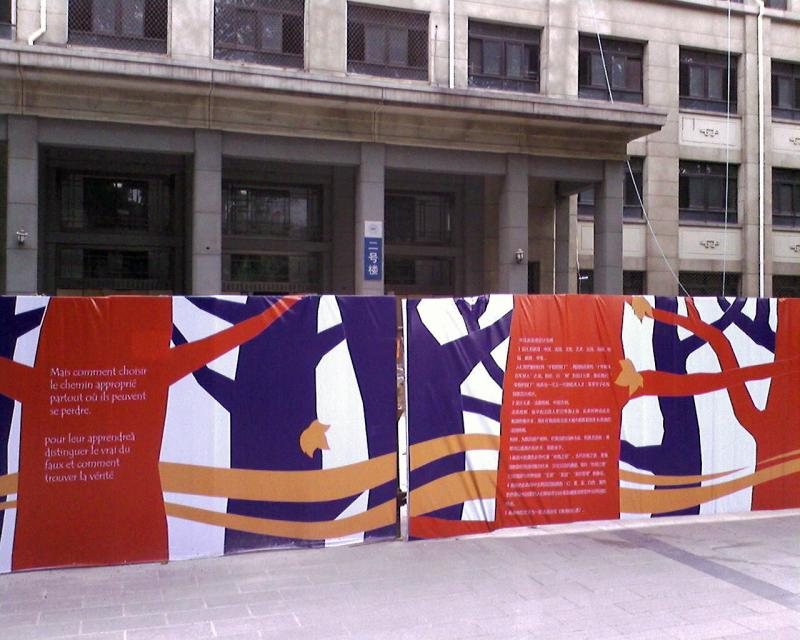

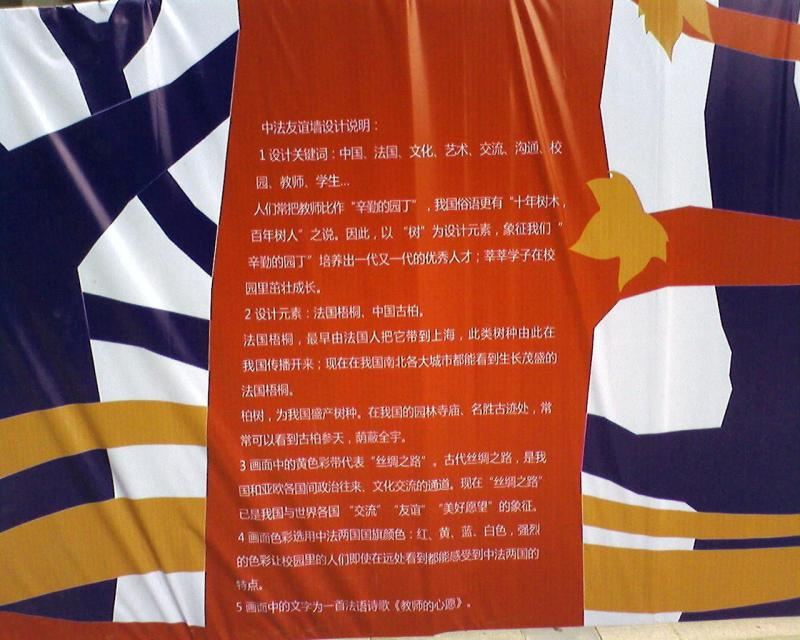
正在装修的二号楼，以后将是中法的专用楼，很期待，据说里边会很豪华

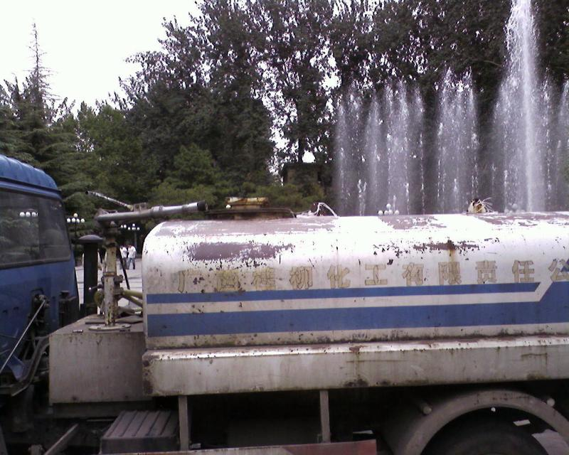
有点黑色幽默……这个，是我在北航里边看到的唯一的提到广西的东西，老乡见老乡，它果然泪汪汪（洒水车）

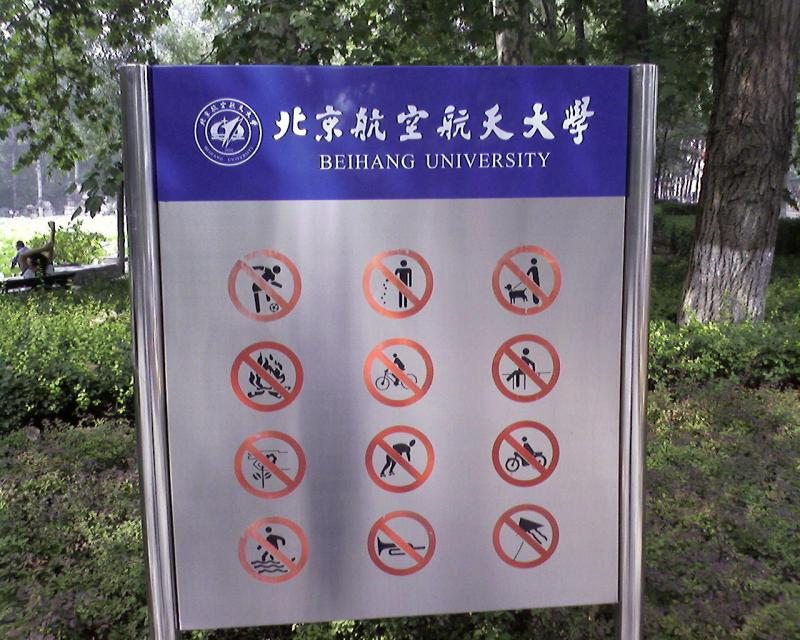
北航绿园前的牌子，很夸张

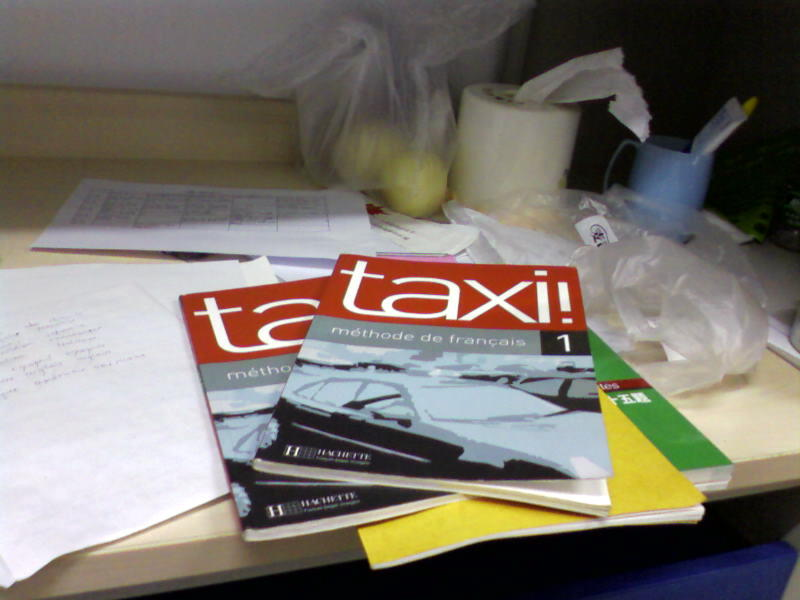

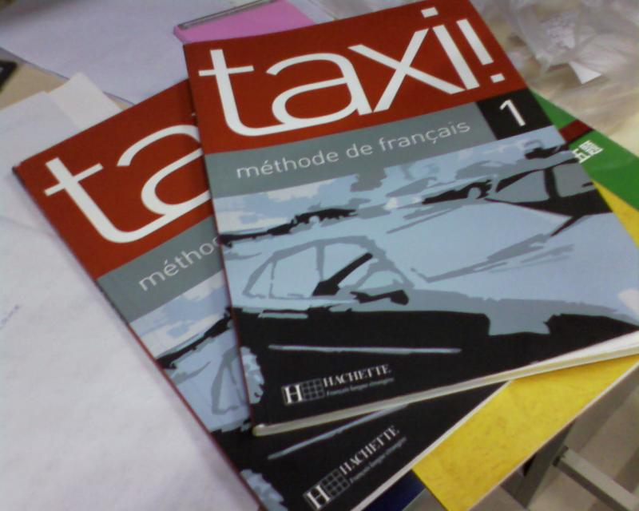
我们的课本，法国进口，价值 100 以上。没错，就叫 TAXI!，法文里边也是叫出租车用到的

我现在还没有电脑，整个大一都只能在机房上，因而总是感觉拘束，这里的许多幅图片都可以扩展成一个个故事，不过时间真的有限……
