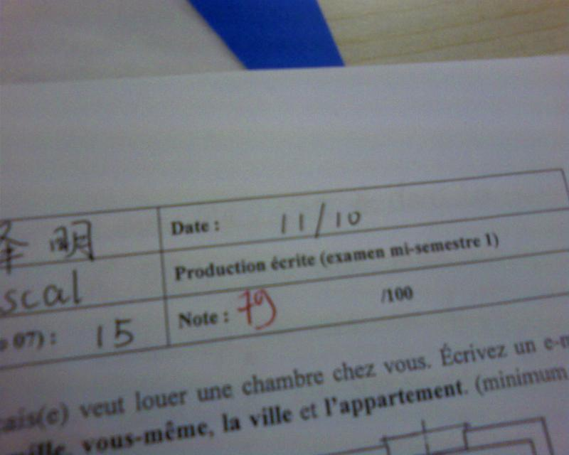
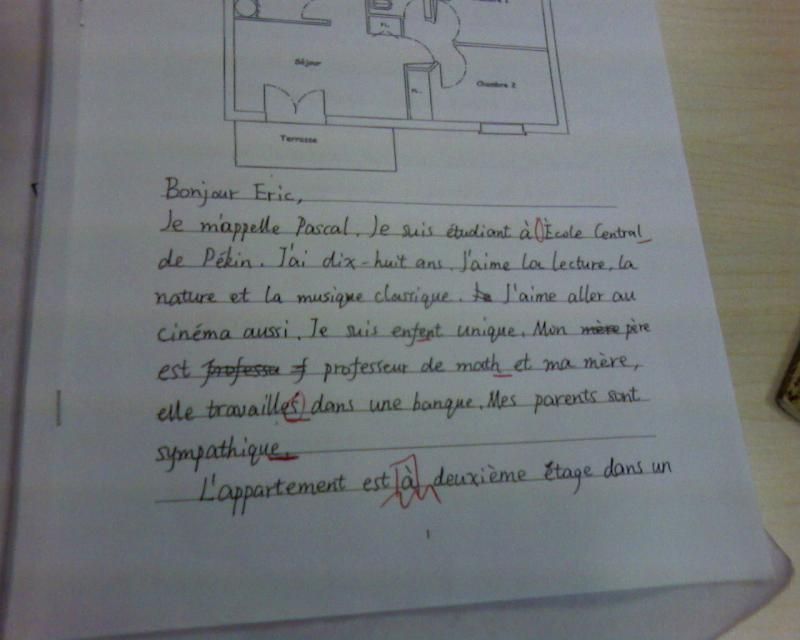
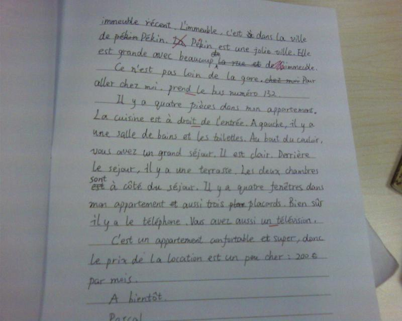
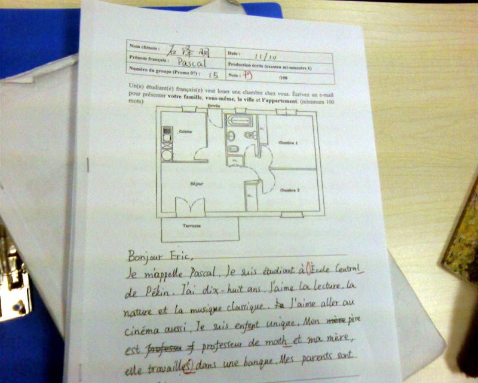

大学的期中考试果然和中学的不一样，首先改试卷就要花很长时间，当然据说是中法全体老师三堂会审才敲定成绩的，这个可以理解。考试的空隙也是难以想象地长，考试周里边我们基本是游手好闲状态——当然我的时间利用的确很不好。
总体来说我的成绩可以接受，法语一共分成五门考，我每门都上了 75，远离了及格线很多。成绩也很平均，都在 80 分上下徘徊，无论在全级还是在全班也都属中等水平。当然我们班的中等水平的人有十几个之多，很无奈。
我们的成绩其实也都很接近，十几分的距离其实不难跨越。
感觉就是，首先，自己没有成为那 1%掉队的人，可喜可贺。
其次，自己还有很大的进步空间，如果把自己的学习习惯改进，把时间利用率提高，前途其实很美好。
第三，我要端正对于考试的态度，努力适应法国的考试制度。
其实在这之前我也思考了一下，我学法语究竟是为了什么？我的学习又究竟为了什么？什么才是我的终极目标？我想，为了 pass 考试，显然目光太短了；为了得到奖学金，那又需要太多努力了，而且容易成为书呆子或者成为分数狂。最后我觉得，自己所需要努力的目标，应该是为了以后在工作中的能力而发展自己。而且，法语不应该仅仅是一个工具，还应该对我来说是一门外语，一种文化，一种我应该和英语一样，整天接触、不断学习的语言。
所以，我还要努力去学习。当然，短期目标还是期末考试……

我的成绩：
|--|--|
|听力| 85|
|口语|80|
|阅读|78|
|写作|79|
|语音|79|

我的写作试卷：

