下雪的前一天晚上，看天气预报，最高气温会下探到 1 度左右，而且还会有小雪。呵呵，让我满怀期待地入睡了。
第二天早上却很狼狈，都 7 点多了，天色还是十分暗，感觉和六点钟时候没有什么不同。我确认了两遍手机时间，发现如果再不起来的话就赶不上吃早饭了。尽管起来的很急，但是一出宿舍楼，我就很高兴——真的下雪了，虽然雪花真的很小，小到可以被看成是一颗颗微粒。但这毕竟是雪。雪不大，没有银装素裹之类的感觉，但是真的很奇妙。
这是今年的第一场雪，也是我人生的第一场雪啊^\_^
唯一可惜的是天色昏暗，手机摄像头不够强大，图片不怎么好看
以下的图片，并没有按照
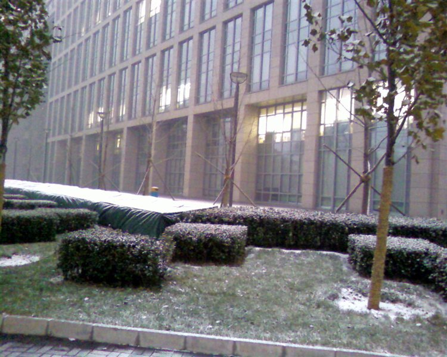

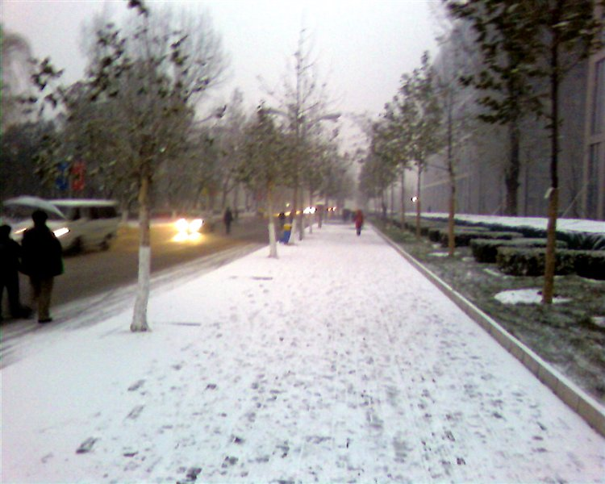

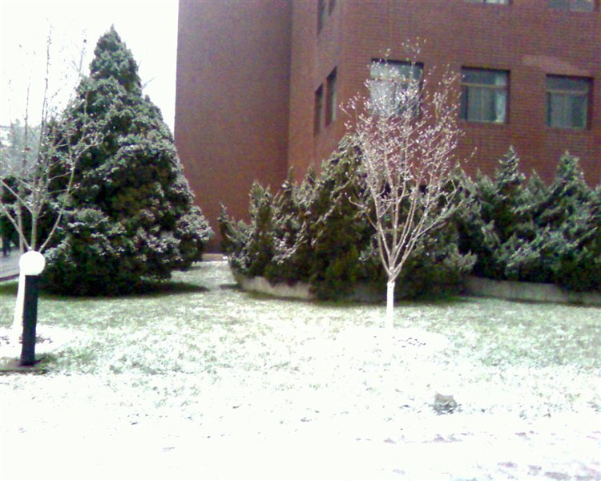

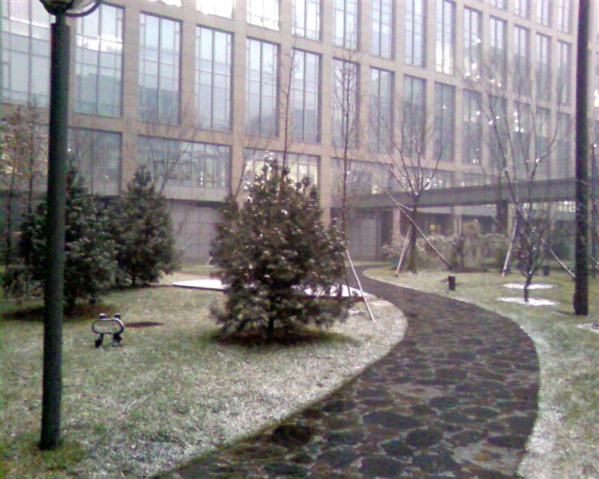

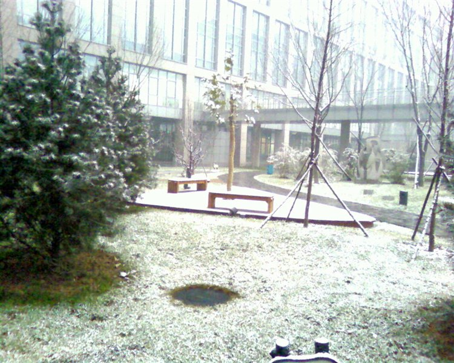

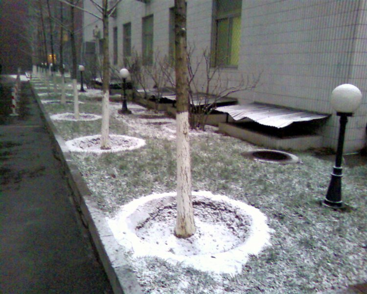

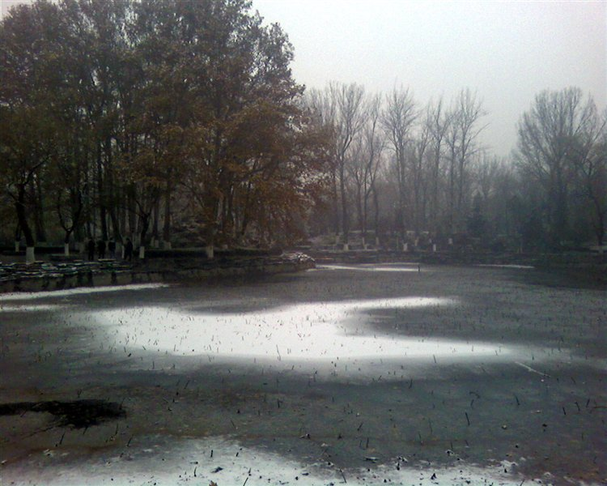

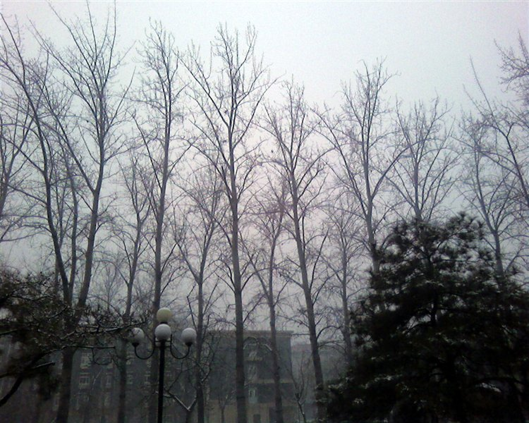

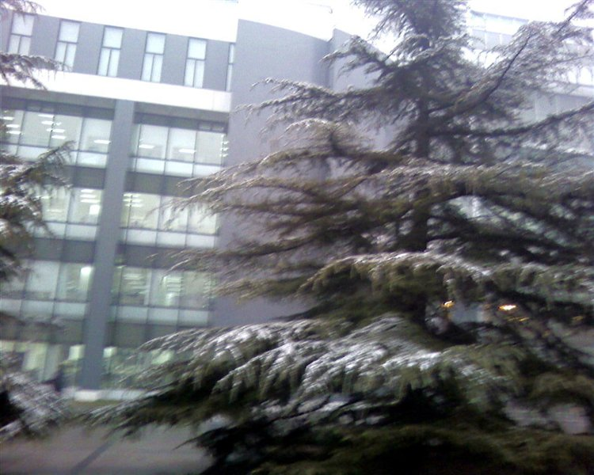

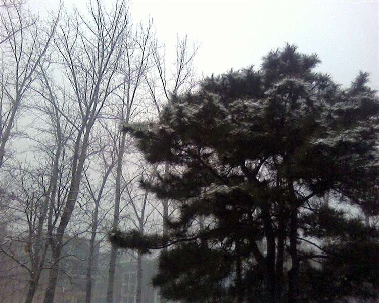

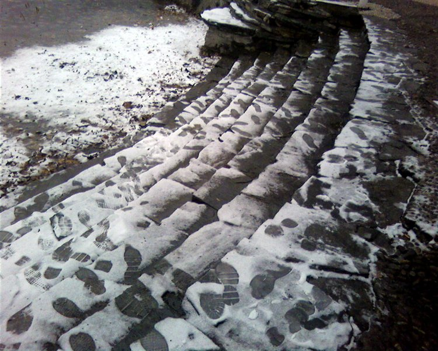

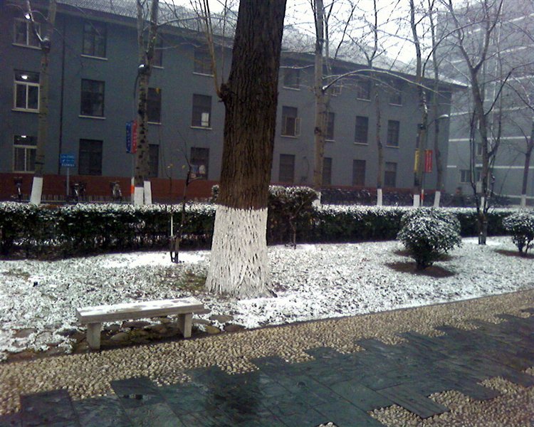

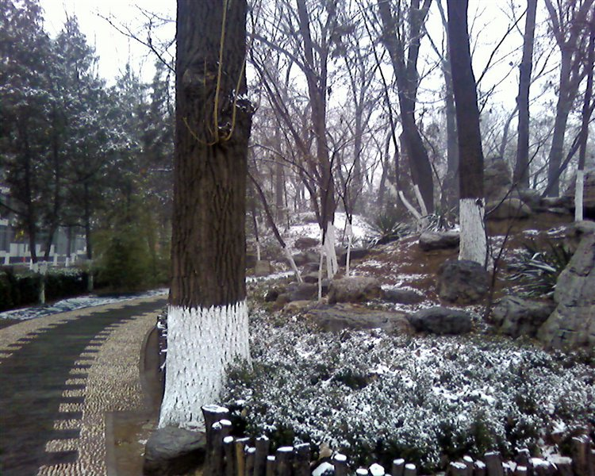

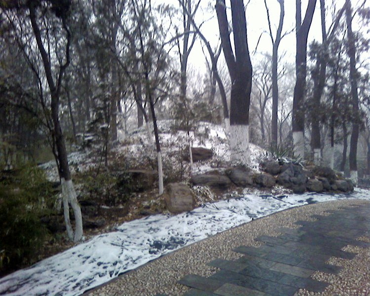

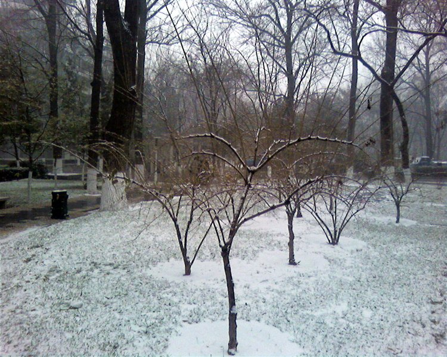

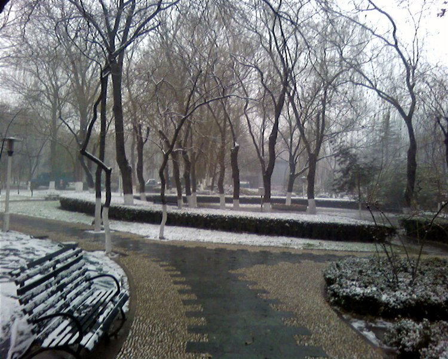

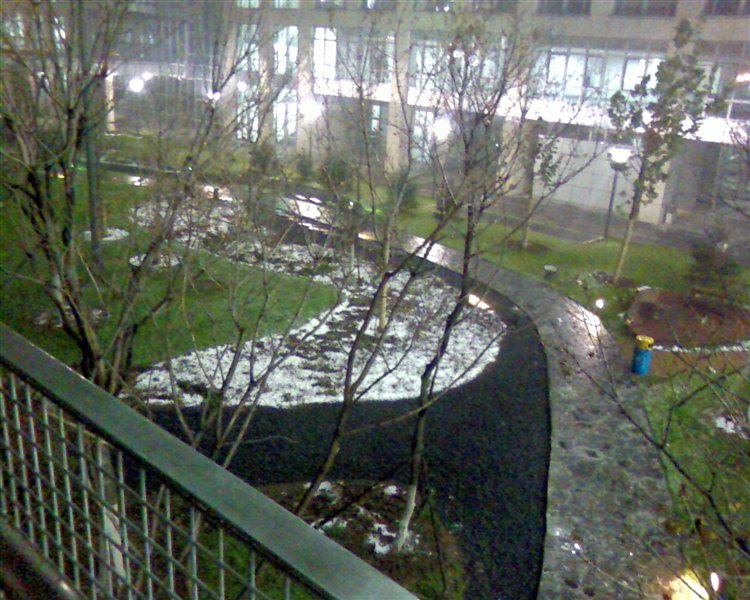
