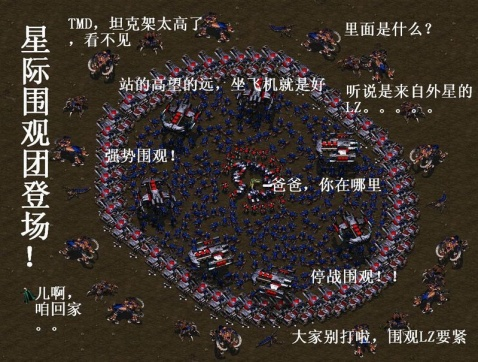
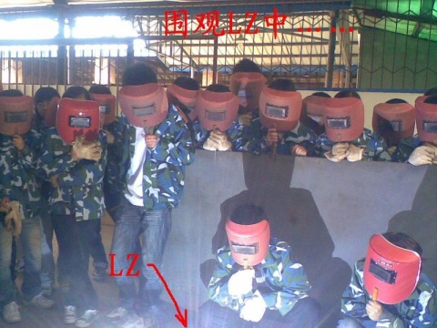

或许楼主注定就是要被围观的。昨天在 CB 发表了那篇解释加油站不能打手机的文章后，我也不幸加入了被众人围观的楼主行列。本来心情有点低落，但是看到连「汽车点火会产生多大的电火花」这样的反驳也能获得四百多赞同之后，总算又高兴起来了。还有那些叫嚣着说让我造出电火花让他们看看的人，谢谢你们的安慰了。我倒不是靠贬低别人来安慰自己，我只是觉得在这种环境下我的说法不被理解也是情有可原。对于一位特地跑来对我进行安慰的网友，我也不留情面。当把问题的对错和智商联系起来的时候，没有什么好讨论的。

对于别的说法，本来想做一下解释的，但是发现自己也是半桶水，对于「电火花」如何产生等等并没有很完整科学的认识。没办法，只好作罢。既然石化行业都没人出来辟谣——他们的辟谣常常是在内部刊物上发表的——我也无能为力。Discovery 的那个实验，似乎是说把一台手机放在油气混合体内，然后外边的人打那台手机。中间还是存在一些疑点的。这种实验被大家认为是科学权威，那我也就坚持己见好了。

总结：
1，「自己无知不可怕，可怕的是大部分人都无知而你却很明白……」这条获得了两百多支持，也不知道是对我的鼓励还是贬低。任何时候，囿于社会分工，普罗大众对于科学恐怕都是不甚了解的。在此打住，再说就扯到民主问题了。
2，要沉着冷静，不能贸然出击，特别是自己也是半桶水的时候
3，遣词造句要温和，要通俗
