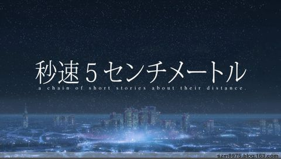

年少的时光总是值得珍惜，稚嫩的念头也有着不一样的意义。然而人生都是残酷的，有得到，便总有失去。这样的事实，不止在少年的时光中，也在成年以后不愿被人承认。所以希望美好，所以怀念拥有，在这样的怀念中又不断地继续失去。这是一个死循环，这是没有出口的悲伤。特别是当考虑到自己所怀念的东西，也许只是因为距离而产生了一种魅力而已。

明媚的春天，悸动的夏天，四季的感情不断地轮回，人也在四季当中渐渐老去。那些没有注意到的细节，映衬的是我们自己的记忆。所以，会在冬天怀念夏天的无拘无束，而在夏天，想起冬天的片片雪花。

樱花下落的速度是秒速 5 厘米，这样没有任何意义的语句，却在以后让人怀念。现时存在的羁绊，反而进入不到心底。倘若能有轮回，故事的走向也不一定就不会不同，错过的东西，恐怕还是会错过。那么追悔能有什么意义呢？世界是前进的，错过尽管让人感怀，但是也是必然。鼓起勇气，向前走，或许才是更加正确的做法。

然而，什么事情不是说得容易呢？迷惘与怅然正如朝气焕发一样，是人生不可缺少的一面吧。理直气壮地去感伤，心安理得地去怀念，这又有什么错呢？世事不如意，退而沉浸于自我之中，这种奢侈的想法，偶尔实践一下，也应该可以被原谅。

人生的珍宝在哪里，没有人知道，哪里又是最值得驻足的地方，旅途中的我们又怎么可能真正分明呢。期望着自己坚强起来，期望着自己能够幸福愉快，然而怎样的情形才能算是最幸福。不可能穷尽一切可能的我们是永远分辨不出来的。所以，秒速几厘米，离梦想有多远，或许在当时都是无从可知的吧。
