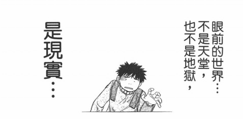

不知从什么时候开始，我变得不爱运动。不爱运动，以前人家会说是文弱白面书生，可是现在的描述词却是宅男。我是这么理解的：现在大家的眼光高了，意识到需要进行德智体的全面均衡发展。而且，运动这事情应该是脑力工作者的专有词——农民伯伯和工人叔叔的劳动量远远大于很多人的运动量。不管怎么说，我很白，也很宅，故而怎么也逃不掉那种指责了。

这学期因为甲流，学校把一千米测试推迟到了 12 月。刚得知还要测试的时候我很震惊：我快一个月没有跑步了，突然去跑一千肯定吃不消。后来听说具体测试时间是下周，于是乎，在一个明媚的冬日下午——之后的傍晚，我开始了跑步。

理论知识告诉我，人长跑时有一种叫做第二次呼吸的东西，可是说真的，我一次体验也没有。曾经有一晚，决定以数学的极限的知识类推，不断地逼近第二次呼吸，可是最后发现自己是徒劳。可见长跑者意志一般都很坚强，能够忍受之前的些许不快。我第一次给跑步震撼到应该是看了电影阿甘正传。我觉得也许是我跑步的时候顾虑太多了，老想着自己达不到所造成的，很多时候，成败就在这样的一念之间。阿甘只是想要跑，他什么也没有考虑，而我跑的时候总在暗示自己快坚持不住了，自己没办法完成，这样的消极心理是会侵蚀信念的。

今晚戴着耳机跑了会，远远没达到第二次呼吸，中途还因为鞋带松开了不得不停下来。不过我想，只要继续跑，坚持跑，身体还是会得到锻炼的。另外，再次提醒自己，这是现实世界。

不知为什么，下一周的事务很多，多到我认为自己无法完成的地步。但是周记的习惯还是要加以保留的。

