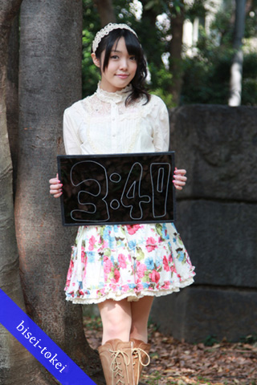

我其实不是声优控，所以附图上的这位是谁我认不出来……况且女生通过化妆总能达到 18 变的效果……苦手……

这个软件其实是 Iphone 上的一个时钟程序，请了 12 位声优来拍了照片，并且配了报时音，精确到分钟的哦。当然少不了的还有闹铃音，24 种风格，基本囊括了大部分萌属性（女王属性萌么……）。所以我最感兴趣的还是这些声音——声优的最大亮点嘛。至于照片，看了一下有几位长相很可爱的，可惜还是叫不出名字。此外大家还是不要追究声优的年龄了，像田村ゆかり这样的 17 岁生日过了十几年的，在 PV 里边还是穿着小女生的服装什么的……大家还是不要再去想了……忘记吧……

下载地址&详介：[http://www.verycd.com/topics/2835557/](http://www.verycd.com/topics/2835557/)

115：[http://u.115.com/file/f4ceda6fa3](http://u.115.com/file/f4ceda6fa3)
