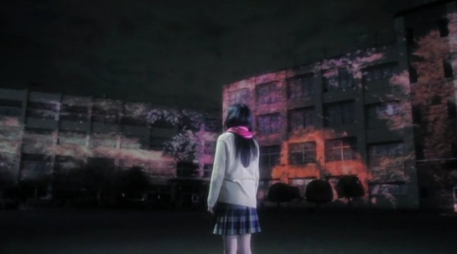

Supercell 曾经演唱过化物语的 ED：君の知らない物語。さよならメモリーズ是他们 10 年 2 月推出的一支单曲。当初选择压片练习材料的时候，很喜欢那支 PV，感觉歌曲也很好，所以就选来压了。到现在 PV 看了不下 20 遍，连带歌曲也听了无数遍，歌词也因为打了一次时间轴所以印象深刻。谁叫我对制服系女高生没有抵御能力呢，呵呵

不过成品什么的，还是自娱自乐吧……我自己其实还没入门呢。



歌词：

```
桜が咲くよ
見慣れたいつもの坂道に
あ、別れを

泣いて笑った
あの日々なんだか
昨日のことのよう

この道はそう(?)1
未来へ続く道
そんな気がしたの

例年より早い開花やそう(?)2
君は嬉しがってた
私は笑った
そうだねって言った
あと少ししたらもうここには戻れないのに

言葉じゃうまく言えないもの
君に打ち上げるとしたらなんて
伝えよ　最初と最後
いつか一緒に帰った道は
私にとって特別な思いで
忘れないよ
さよならメモリーズ
春が来たら　それぞれの道を

また会える日を願って
さよなら小さく呟いた
空はあの日と
変わらず　青くて
だからちょっと待ってた

わざと遠回りしたの
少しでも長く君の隣いたくて
私はお届けに(?)3
間違えたって言った
君が笑うその顔が眩しくて
目を逸らした

言葉じゃうまく言えないもの
夢みたいでこの道を歩いた
憶えてる　あの時には
私の名前を呼んでくれた
二人暮れの帰り道で
忘れないよ　さよならメモリーズ
出会えたこと　感謝してる

初めて見た　満開の桜
あれからどれぐらい
変われたから(?)4

一目見たときに思ったんだ
この人のこと好きになりそうで
なんでかな　分かんないよ
それからの毎日はとても
楽しくてだけど同じくらいに
辛かったんだ

ごめんね　なんかうまく言えないよ
だから私君となんていうか
今のまま　さよならしたくないな
友達のままじゃ　もう嫌なんだ
言おうと覚えてた
私
君の
君のことずっと　ずっと
前から　好きでした

ああ、やっと
見えた
```
