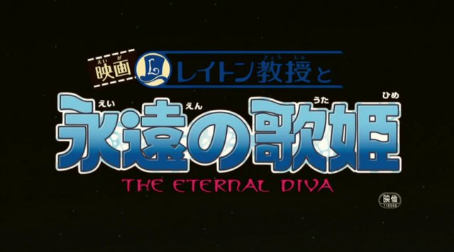

这部剧场版改编自解谜类游戏雷顿教授系列。我只是无聊时看到有字幕组在做所以才下回来看的。看的时候才发现原来有 P.A.Works 参与制作了。之前我还以为他们忙 Angel Beats!已经忙不过来了呢。

解谜类的东西一般都很讨厌物理，因为物理这东西很不听话地限制着剧情的发展。于是很多作品就一不做二不休地无视了物理规律。本作也属于此类。不要再说柯南 M13 怎么天马行空了，在本作前他们都是小巫。还好，这个片子还遵守了事理，还算有着基本的逻辑。在画面上，本片画得还是蛮精良的，对于游戏的画风也继承得很好。但是再怎么好的制作也不能不让我泪流满面啊：这明明是少儿片……所面向的群体肯定是少年儿童，因而所揭示的道理也浅显到人人张口能言的地步了。综合评价，本片中等吧。
