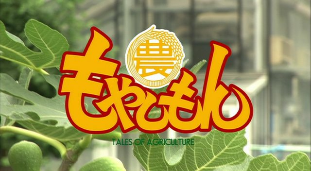

《もやしもん》，译名为豆芽小文或者萌菌物语，讲述的是一位看得见细菌的少年和他的伙伴在东京农大的欢乐生活。在当中也穿插了关于细菌的科普知识。这部动画实在是很有意思，人物都极具性格，出现的细菌也很萌很可爱。在片中表现出来的日本的农工大学的风景更也让我感觉新奇有趣。自己评价这部作品属于中上，在推荐之列。

值得一提的是本片的实景 OP 做得十分之精致。用三维动画做出来的萌菌和实景融合得非常地好，OP 中出现了玻璃、光滑金属表面等材质，而得益于优秀的图形技术，该反射的的地方都做得很到位。
