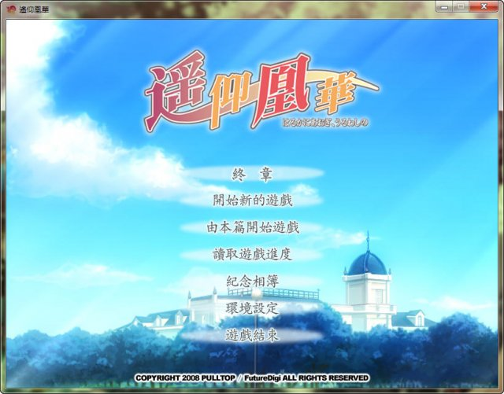

本文含有少量剧透成分，请小心阅读，如感到不适请立即关闭本页。

和某位怪蜀黍（雾）讨论了一下遥仰凰华，最后觉得自己还是得写点什么，系统地散播一下自己的观点。

得益于 PULLTOP 注重剧情而不注重选择到全篇没有 BE 的设定，《遥仰凰华》成为了第一个被我完全攻克的 Galgame。之前的《CLANNAD》，我的完成度已经很高，但还是有部分剧情没有经历。遥仰凰华的游戏选择枝是比较奇特的，六位可攻略角色被分成了两组，本校系和分校系。两个系分别由两位编剧独立写成。这也造成了本校线和分校线的迥然不同的叙事风格。本校系较为纯洁，最出位的也就是捆绑；而分校系更像是拔作，两位姐妹的 H Scene 占据了全作的绝大部分，题材更是囊括了口\*，肛\*，自\*，羞耻 play 等（星号为自我和谐部分）。

若论喜欢哪一位角色的话，我首推可爱的理事长和稳重的美绮。事实上他们也是我最先攻略的。我也和某些宅友一样，认为不能攻略奏和镜花的确是一个遗憾。然而从游戏叙事的角度来说，我更欣赏的是分校线的剧情。理由一，本校线的人物内心活动很多都得通过调整人物，用人物内心旁白来阐述。一条线甚至能换上两三个人。虽然我不认为这种方法是错误的，但是相比分校线仅从禽兽教师的角度就把他人的内心也说表达清楚了这一点来看，本校线略为逊色了。理由二就是本作中唯一一条的暗色线臻叶线。这一条线是很灰暗的，然而却有存在的必要。同时这一条线也阐明了隐藏在其他线下的许多不明真相，击破了这一所学校的幻象。有这条线存在真是可喜可贺。

最后说一些无关的东西吧，我玩的是未来数位代理的台版，本版本不安装补丁的话，选择分校线和本校线的选择枝是颠倒了过来的。此外，PULLTOP 的另外一个作品《雪之华》也是我很喜欢的，虽然同样弱选择，但是故事是很精彩的。
