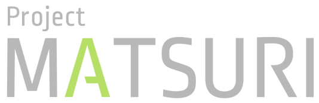
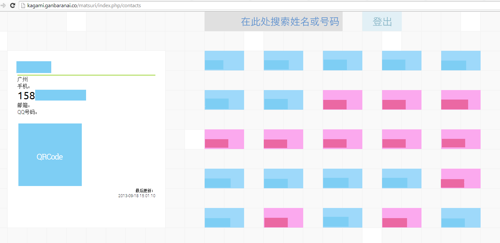

去年 9 月末 10 月初的时候，我处于对于工作比较迷茫的一个阶段，不知道应该是去读个博士，去工厂，还是投身码农事业（虽然就算到了现在也只完全否定掉了第一个选项），同时也刚好想找点什么东西来钻研一下，尝一尝很久没有过的 Eureka 感受，所以就开了一个个人研究项目。目前的成品摆放在http://kagami.ganbaranai.co/matsuri/   上边，因为都已经导入了真实的数据，所以需要密码才能访问。至于没有登录按钮的脑残设计，稍后再说。

这个项目最先完成的部分是一个 LOGO。

Matsuri 是茉莉的罗马音，同音的名词还有祭典，某个游戏人物的名字，读着觉得挺朗朗上口的，再加上角色也是自己喜欢的类型，于是就这么用了。字体是 DIN Demibold，然后转成路径自己修出来的。因为自觉这 LOGO 的效果还行，我就想到做个小网站来搭配了。之前和高中同学聊过做一个在线的同学录的事宜，并且自告奋勇地承担起了前端美化的工作，所以就想到了干脆就做一个在线同学录吧，要做就做彻底一点，干脆前后端一起做。于是项目就在没有任何需求分析和调研的情况下开工了。

因为是比较简单的网站，就是想显示一下班级同学的联系方式，也没有什么扩展到多个班级多个学校的需要，逻辑上也没有太多交叉，就直接跳过了建模的步骤——后果是到最后边定数据库字段长的时候还是挺踌躇的。

技术方案选择方面，考察过 RoR，node.js 和多个 Py 框架之后，决定还是乖乖地先用 php 框架。目前的空间支持 php，然后 php 感觉也满足需求。数据库也是看了几个 NoSQL 的之后乖乖地用了 MariaDB，这个倒是因为觉得 NoSQL 的难度在此项目中略高……

至于 PHP 框架，看了 CodeIgnitor，Kohana，CakePHP，Symfony 等多个框架之后，选择了 CI，CI 的文档在几个轻量级框架里边是比较清晰美观的，虽然 Symfony 的文档也很丰富，但是比较重量级了一点。至于 Zend，从一开始就被网上的各种说法弄得全无好感。

我之前对 MVC 模型只有纸面上的认识，第一次实践，的确遇到了不少难点，还好 CI 的 MVC 比较简单，借助文档和 Stackoverflow 之类的问答社区，基本没有遇到比较大的障碍。感受比较深的就是个人单枪匹马写网站，常常在 MVC 三方面来考虑问题，脑子一开始有点转不过来。前期图方便没有写太多的注释，到后来 debug 的时候略痛苦。这个级别的小项目都让我有点焦头烂额，看来自己仍然需要持续学习。

由于某些原因，这个项目最后没有全部完成，展示和搜索做完了，但是信息编辑与多权限管理的部分还有待添加。此外我也有把程序换到 Symfony 框架上的想法，希望什么时候能有时间完成这个计划吧。

下边是一点展示图，前端是用 ajax 把 encode 成 JSON 的数据用 jQ 展示的，二维码是实现了的，在这里是全部隐去了。

