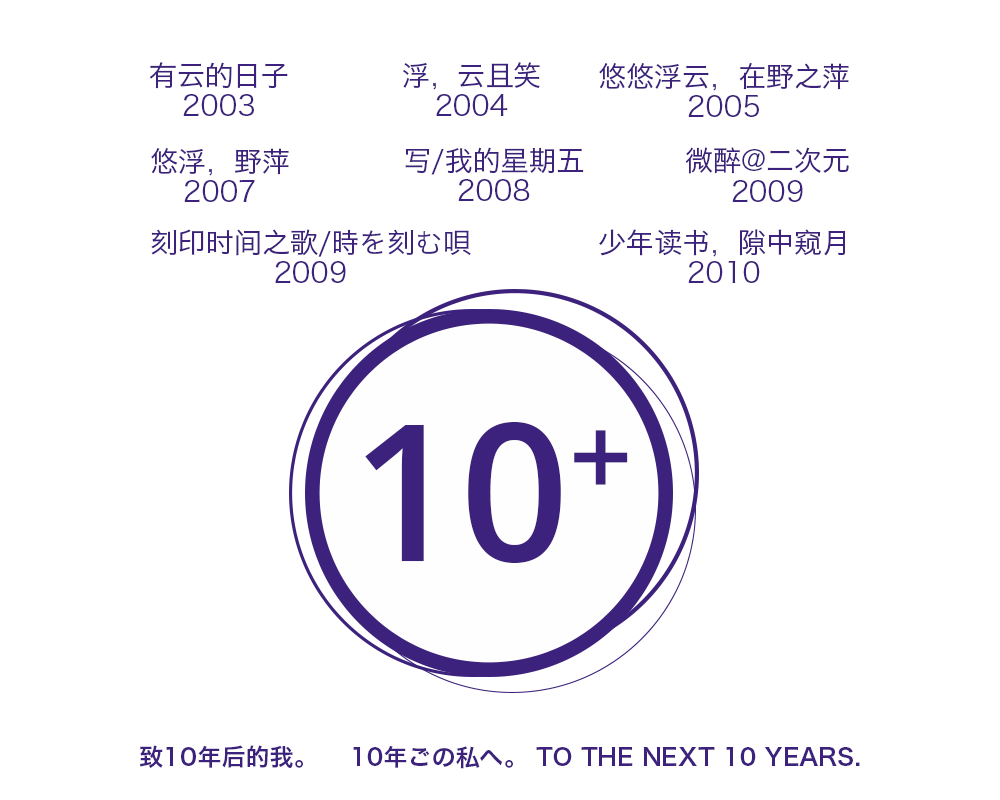

在生存 25 年，学会走路 20+年，看动漫 5 年之类的大大小小成就之后，我终于又解锁了一个新成就：写日志 10 年。

10 年的日志经历，其实和 10 年的灌水，10 年的 QQ 之类一样，稀松平常，翻看过去的一篇篇文字，一句话心情和为赋新词的浓度很高，那些天真的念头和中二的思绪，我都不好意思看下去。如果不是因为有“微博”、“状态”之类的出现，现在的我说不定仍然天天更新博客。 不过，需要承认的是，那些文字的作者都是我。当年写下的东西，尽管可能言不由衷，可能词不达意，也可能心不在焉，回想起来也不能百分百还原当时的真正想法，但至少是有形的，可以从中品尝到百般滋味。

感谢这个信息的时代，文字的信息化，使得表达变得简单，存储和收集变得容易——虽然信息并不能因此变得更有价值，有形的描述在多年之后，也不一定能比得过反复美化后的回忆。

印象中已经这样讨论过几次写日志的意义，也偶尔会在心中自问是否有坚持的价值。不过现在的我能确定的是，我还想要写下去。在下个 10 年里，制造更多的记忆，也生产更多的信息垃圾。
