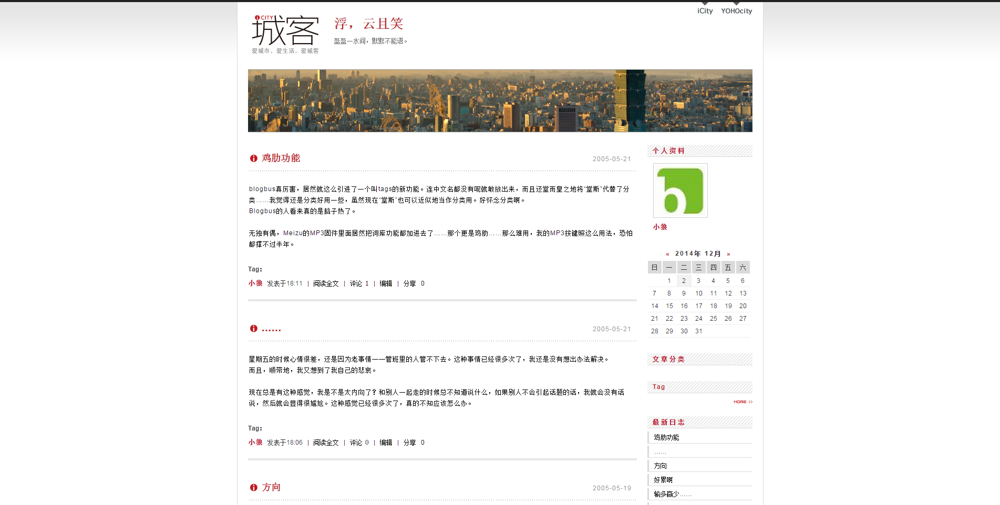
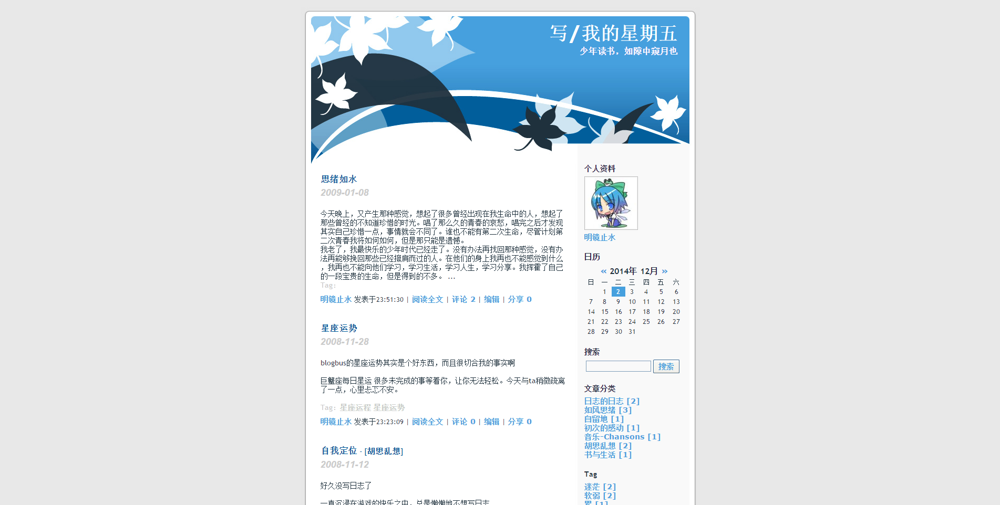
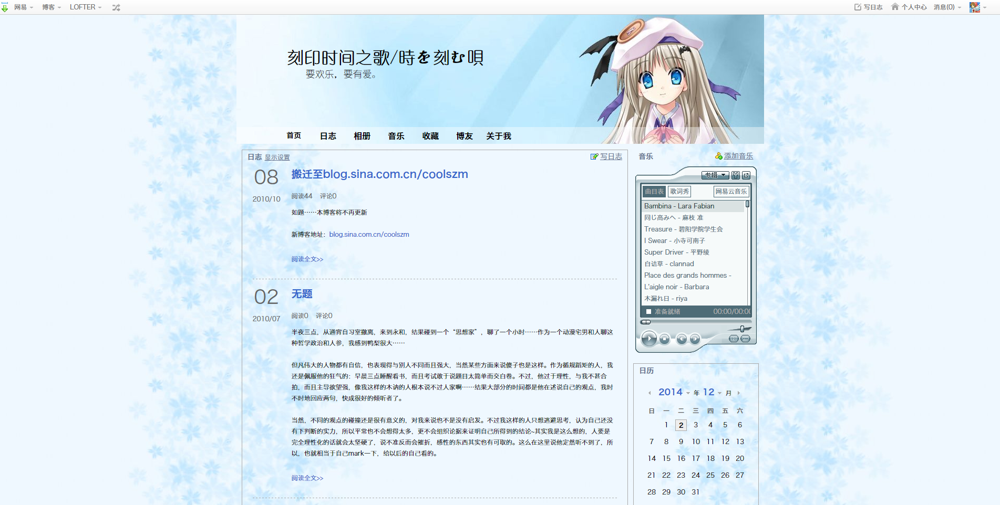
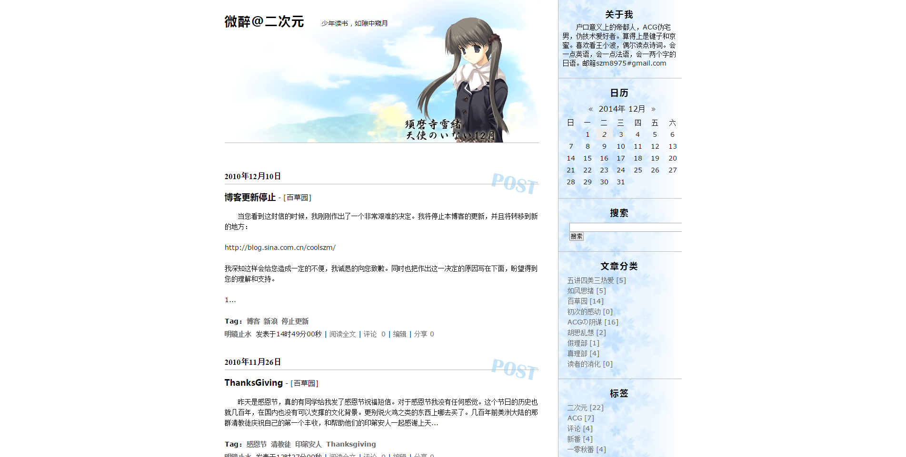

（2014 年 12 月 2 日更新：由于之前的服务器事故，原图已经无法找到，配图均为恢复日志时补充）

其实，我是很偶然地想起来，我写日志已经写了很长时间了。然后再掐指一算，居然已经 10 年了。 于是跑去看了看早期的那些日志，感慨感慨之余，想到最近的 wp 用的比较稳定了，于是干脆把以前的数据全都转了过来。 当然世界上没有那么免费的午餐，连当年开放地可以导出数据的博客大巴都已经自我封闭了，导出过程中还是遇到了各种艰辛。这一段按下不表。 总之虽然不少图片虽然已经没有大图版本（我也不记得当时是不是大图版本了），但数据是基本找全了。 在整合进来的过程中，因为之前几个博客相互之间引用导入的关系，有一些重复的日志，我最后是连着评论一起删除了。 虽然原始数据里边还有，但是有一些评论就没有出现在该有的地方了。在此对各位评论者表示歉意。 下面，且容我介绍一下十年来不断迁徙的旅程：

## 有云的日子

博客生涯的上古年代，在某个免费空间上存在的个人网站。不说设计稿了，我现在连截图都找不到了。数据也是全部熵解。

## 在博客中国的某博客

乘着博客的春风而注册的。中途时间很短暂，我光是回想确认是博客中国（Blogcn）还是中国博客网（Blog China）都很困难了。这两家网站也多次改版转手，估计也找不回来了。

## 浮，云且笑（[http://coolszm.blogbus.com/](http://coolszm.blogbus.com/)）

04 年开始写作的活化石，托管在博客大巴上。看着这个有一种还原古代人刀耕火种的生活图景的感觉。正好是中二的年纪，写的东西自然也是相当地中二。同时，因为当时是周末才能够上网，所以也是想方设法地找东西来写。 那时候博客大巴还是可以用 html+css 设计模板的，我自己也应该设计过，但是模板几次改换之后也不见了…… 标题化用自 Twins 的歌曲《梨涡浅笑》（也许吧 至于云，肇始应该是上海《少年文艺》上登过的一片小说《巫山一段云》，暗合元稹的“除却巫山不是云”，听起来多带感啊。至于用户名是小狼……咳咳……

## 悠悠浮云，在野之萍（[http://spaces.msn.com/coolszm](http://spaces.msn.com/coolszm)）

2005 年起托管在 MSN Spaces（后更名为 Live Spaces）上的“空间”，由于微软的中二想法，这已经尸骨无存，只留下一个名为 Space.zip 的压缩包。 关闭之前我没有转到新浪或者 Wordpress 上，是因为里边的内容看一次就想回去烧自己一次。前期还敢开放浏览，到后期就已经变成 MSN 好友可见了——而我的 MSN 上是没有好友的。 博客题是化自《诗经 鹿鸣》/《短歌行》的“呦呦鹿鸣，食野之苹”。子域名的选择，是借鉴了当时觉得设计得很不错的一个个人网站[圆舞的天空](http://www.coolvvan.net/)，它也是改版多次，我都快忘记当初的外观了。

## 悠浮，野萍（QQ 空间）

07 年开始使用 QQ 空间，有一些内容是只发在空间里的，到后来也用来将别的博客的内容导入到 QQ 圈。具体没什么好说的，QQ 空间现在还变得严肃一点了，当年是娱乐大于实质的。

## 写/我的星期五（[http://ipascal.blogbus.com/](http://spaces.msn.com/coolszm)）

08 年在 Spaces 上留下最后一篇文章之后，又动起了自己美化博客的主意，于是又重回了博客大巴。因为觉得之前的自己太中二的原因，所以另起炉灶。博客标题中，”写“来自于这篇日志，星期五的解释可以看这里。 然后还是一次误操作，把标准模板覆盖了自己的自定义模板，所以现在也找不到原来的设计样式了。

## 刻印时间之歌/時を刻む唄

其实这个博客建立的时间应该比上边那个还要早。第一篇日志也是发表于 2008 年。只不过后来使用的频率才变多了起来。从这个时期开始有了不定期更换题头的传统。至于为什么，是因为只有背景图片和题头图片可以自定义啊…… 图片中的文章是后来把 QQ 空间的文章导入之后的结果，原来的文章也已经被扔垃圾箱了。因为弄得混乱得很，现在这个博客处于关闭状态。 博客标题，看过《CLANNAD ~After Story~》的应该懂。

## 微醉@二次元（[http://ivress.blogbus.com/](http://ivress.blogbus.com/)）

又一次在博客大巴上另起炉灶，这次用的子域名是 ivress，法语中的微醉的意思。我是从《Complainte de la butte》里边找到这个词的。难得一见的保存得比较好的模板，现在看有一种珍贵文物的感觉。同时也深刻地意识到自己当年的水平真是糟糕。 这一次坚持到了 2010 年，从那年年初开始访问起来就很不方便，在家里还好，到了学校由于网络的亚克西属性，有时候翻墙访问还更快一点 = = 网站的副标题“少年读书，如隙中窥月”，典出张潮的《幽梦影》：”少年读书如隙中窥月，中年读书如庭中望月，老年读书如台上玩月“。这一句话个人觉得很好，所以后来我干脆就把它当作博客标题了。

## 少年读书，隙中窥月（[http://blog.sina.com.cn/coolszm](http://blog.sina.com.cn/coolszm)）

貌似因为时间离得比较近，没有什么可以解说的样子。换过很多次头图，嗯。

## 现在：少年读书隙中窥月

2013 年 4 月开始搬来这里，2014 年初买了自己的顶级域名。 刚改了下主题，做了个全站 LOGO。 文章其实没写多少，倒是有很多开了个头的草稿。至于欠债也不少，有时间还是需要吐出来。 后记 这么多日志一下子导进来，后续的处理还是比较繁琐的。QQ 空间的日志也许有涉及到比较隐私的话题的，需要自己再审一下（我才没有劝诱你们去看我的日志呢）。 关于分类，各个时期不同的分类方式都揉到一起了。关于动画的还好，以前都分类成”ACG 的阴谋“，现在直接并入”二次元阴谋“里边了，剩下的是各种乱。原来博客上的分类也不是很合理，总而言之是需要一通大扫除。 以前的日志抓取的时候程序默认开启了谷歌翻译（SEO 的目的），等到发现的时候所有的静态链接都已经是翻译过的了 = = 懒得再修改了，以后看到个别不靠谱的再修改。 还有很多文章没有标签。准备顺其自然了……
