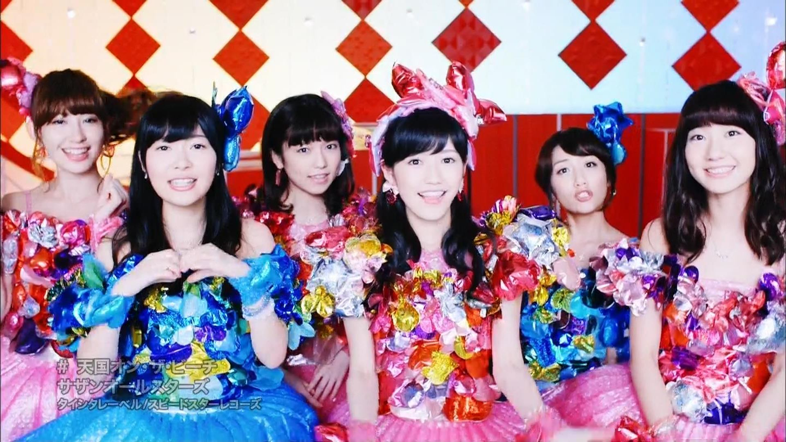

这群年龄都在 50+ 上的老年人组合今年又出了一张新单曲。里边的三首歌我都挺喜欢的。

### 東京 VICTORY

去年他们出的《ピースとハイライト》是世界和平主题，歌词和 MV 里边隐喻中日美三国。今年也是顺应时事，主题变成了健康向上的东京奥运以及不断努力的女性群体。算是他们少有的励志型曲子。[巴哈姆特（需科学上网）上的同好翻译了歌词](http://home.gamer.com.tw/creationDetail.php?sn=2583863)，借花献佛如下：

```
東京 VICTORY

サザンオールスターズ Southern All Stars 南方之星

三井住友銀行 CM ソング

作曲︰桑田佳祐
作詞︰桑田佳祐
Wow…

Wow…

時を駆けるよ　 Time goes round
変わりゆく　 My hometown
彗星(ほし)が流れるように
夢の未来へ　 Space goes round
友よ　 Forever young
みんな頑張って
それ行け　 Get the chance!!

隨著時間的奔跑　 Time goes round
漸漸改變的　 My hometown
彗星那樣流動的
像夢一樣的未來　 Space goes round
朋友們呢　 Forever young
大家加油
那麼去吧　 Get the chance!!

果てしない空と
海の青さに
胸が騒ぐ

無止境的天空
和海的湛藍
在胸口的撼動

幸せ求めて
人は出逢い
愛を交わす

追求著幸福
和人的相逢
用愛的交替

こんな争い事や
不安に満ちた世の中だけど

這樣的爭執的事
或是在充滿不安的世界中 但是

時を駆けるよ　 Time goes round
麗し　 My hometown
恋の花咲く都
回る　回るよ　 Space goes round
明日への　 Winning run
風になりたくて
翔び立て　 One more chance!!

隨著時間的奔跑　 Time goes round
漂亮的　 My hometown
戀的花朵綻放的東京
轉動 轉動吧　 Space goes round
通往明天的　 Winning run
想要跟風一樣
在裡面飛翔　 One more chance!!

私を抱きしめ
守ってくれた
人はもういない

我守護著
想守護的人
卻都已經不在了

希望の灯火(ともしび)
それは金色(きん)に光る
一番星

希望般的燈火
那是金色又發亮著
最亮的一顆星

どうせ生まれたからにゃ
生命(いのち)の限り旅を続けよう

就是從出生開始
在生命中不斷的旅程

時を駆けるよ　 Time goes round
変わりゆく　 My hometown
川の流れのように
ビルの街にも　 Rising sun
勝利の　 Final countdown
自分を追い越して
それ行け　 Get the chance!!

隨著時間的奔跑　 Time goes round
漸漸改變的　 My hometown
像流水般的
在大廈中的街上　 Rising sun
勝利的　 Final countdown
自我的超越
那麼去吧　 Get the chance!!

Wow…

Wow…

時が止まったままの
あの日の　 My hometown
二度と戻れぬ故郷
夢の未来へ　 Space goes round
友よ　 Forever young
みんな頑張って
TOKYO, The world is one!!

時間停止下來了
那些日子的　 My hometown
沒有再回去的故鄉
像夢一樣的未來　 Space goes round
朋友們呢　 Forever young
大家加油
東京，是世界第一!!

We got the victory!

We got the victory!
```

### 天国オン・ザ・ビーチ

这首歌要说的话,就是他们一如既往的湘南风格,海边,沙滩,男男女女,还顺便有一点工口气。只不过现在都九月了，有点过季了吧。本歌最让我感到惊讶的是 PV 的客串阵容，第一次看的时候不知道，只觉得那几个妹子怎么这么眼熟，之后一查，除了他们自己以外，还有：

- 安倍なつみ
- 飯田圭織
- AKB48（小嶋陽菜、指原莉乃(HKT48)、島崎遥香、渡辺麻友、高橋みなみ、柏木由紀）
- 奥田民生
- ガッツ石松
- 木村カエラ
- 斉藤和義
- DREAMS COME TRUE (吉田美和、中村正人)
- 中澤裕子
- 平井堅
- 星野源
- 増田惠子
- 吉井和哉



SAS 成功地教会了我什么叫做低调地秀资历和人脉……

### パリの痴話喧嘩

某啤酒广告主题曲。和十几年前的那首《愛の言霊 〜Spiritual Message〜》一样，桑田大叔把日语歌词唱出了法语的感觉……感觉他的法语水平应该提高了不少。
