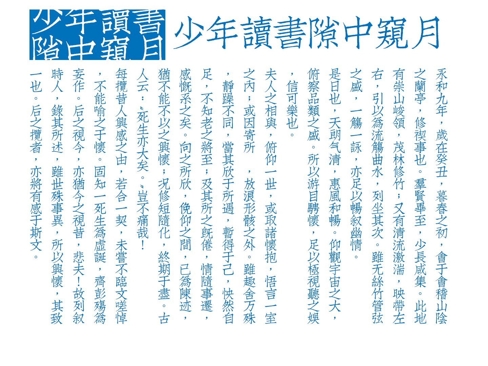

由开发了康熙字典体的[厉向晨](http://www.zhihu.com/people/Digidea)同学发布的文悦古体仿宋发布了，面向非商业应用免费，对于我来说是一个好消息，在此深表谢意。

之前就决定日志 LOGO 要用宋体或者楷体，但是好用的宋体实在是不好找，普通的例如博雅宋之类的太文字化，没有图形区分度，别的好看的宋体都是要大把大把钱的，例如 [TP 明朝](http://www.typeproject.com/font/tpmincho/)，如果我买得起的话，肯定会大用特用。现在的日志 LOGO 所用的字体是方正清刻本悦宋，个人授权。这字体古意是足够了， 美中不足在于只有简体……

看到这个字体发布，感觉又有想法来写代码了，我决定还是坚持当初的阅读中心以及简单化风格，首要就是把侧边栏砍掉，至于什么时候开工……看心情。
