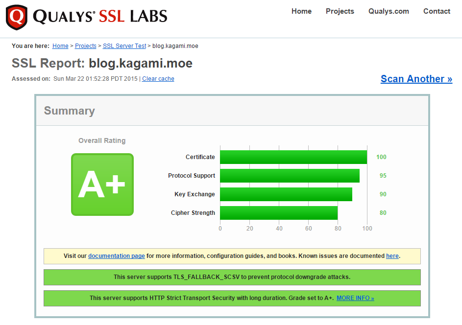

前阵子贪便宜买的长期 wildcard 证书因为被服务商发现是利用漏洞申请的，所以被吊销了。我相当于交了学费，知道了来路不明的东西要小心去碰，以及不是所有看着道貌岸然可以亲近的人都是好人，更不该因为顶着二次元头像就提升信赖度。

不管怎么说，SSL 证书还是需要的，于是买了一年的 rapidSSL 证书，卡在域名所有权验证上很久，在安装的时候误把服务器配置文件删掉了，于是又折腾了半天。不过好处是重新弄了一下设置，[SSL 评分](https://www.ssllabs.com/ssltest/analyze.html?d=blog.kagami.moe)略有上升。

设置主要参考的是[这篇文章](https://raymii.org/s/tutorials/Strong_SSL_Security_On_nginx.html)。cipher strength 说的是加密的位数，个人觉得 256 位还不是很必要，所以还保持着 128 位的。
