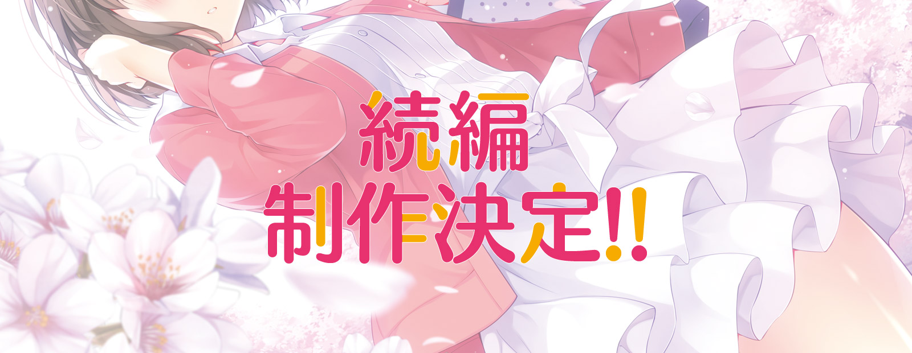
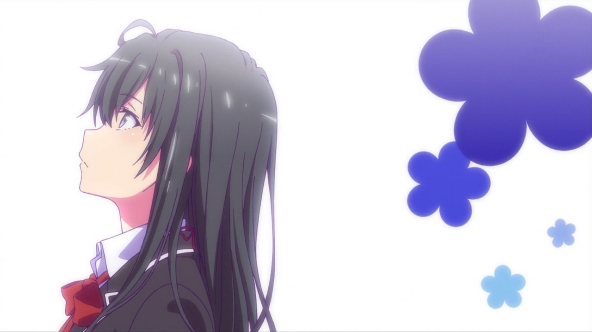

上一版的主页做了也快一年了，前两天心血来潮，于是又做了一个新版本。这个版本融合了《大春物》和《不起眼女主角的育成方法》的相关要素，比如下边的这个和这个：

整个页面比较麻烦的部分在于 canvas 路径的绘制，为了绘制出正确的花形（这个词感觉哪里不对），狠狠地复习了一下解析几何的知识，并对 Javascript 的 Math 库的几个函数进行了充分的理解与运用。目前的代码就是单纯地绘制，如果以后有精力的话还可以做出像《未闻花名》ED 中的那种下落效果，就是代码会比较复杂，要考虑重绘，还要考虑路径对象的生成与销毁。

字体方面，鉴于 Light 字重的汉字字体不是随处都有的，而用路径绘制又太麻烦，最后用的是图片。为了防止次级像素造成的边缘锯齿问题，使用了 2x 缩小的底图，把麻烦的锅交给浏览器了。从观察到的效果上还不错。

和我做的别的一些页面一样，此次制作过程中也参考了别家的作品，再次感谢 Evan You （http://evanyou.me/ ）的创意启发。

P.S. 下单买了一大堆 PC 升级的配件，除了 CPU 和电源之外别的都换了，虽然初衷是装黑苹果吧……
