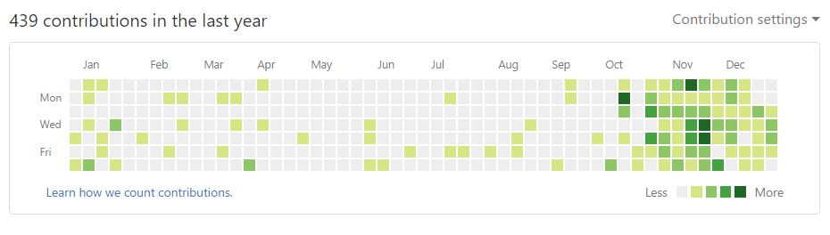

差不多有大半年没有写日志了。这一方面有我想要切换日志系统，结果还是难产的影响；另一方面，也总是找不到想写的念头，总希望，能够在事情有一点眉目的时候，才好好地做一个事后的总结。不过看起来，目前的状态还要持续一段时间，2016 年都要过去了，也正好算一个打断沉默状态的契机，所以还是写一点什么，做一个小结。

简单地说，我在 5 月中旬提出了辞职，然后在 6 月 30 日的时候正式离职，之后就一直处于纯粹的 NEET 状态，躲在家里度过了夏季的炎热，秋天的物哀，还有冬天的雾霾。离职算是有一点冲动，但也算是完成年度计划的一部分，所以，我只是在执行下一个小目标，找一份写代码的工作的时候，迟迟没有进展而已。虽然是 NEET 生活，但是也是会出门购物，偶尔也吃喝玩乐一下，并不是真正的与世隔绝。当然，因为不去上班，社会活动还是减少了，独自一人的时间也变得更多了。

虽然不愿意承认，但是自己这半年的生活模式的确可以用山中修炼来形容。所谓山中修炼，就是闭关苦学，成为武学宗师，然后再出山。我也是计划，先学习一段时间的基础，再去求职。不过，代码这一行，很多东西概括起来简单，钻研也有起来很多内容，越学习就越感觉学得远远不足。除了对自己的水平没有足够的信心之外，受到一些负面传闻的影响，我对这个行业的信心和看法也发生了一定的动摇。概括起来就是，我会问自己，我能找好好地找到工作吗，我找到的工作会足够好吗。

这种问题很难回答，当然我也对于这种情况有所预想，心里是设定了一个期限的，只不过拖延症犯起来就开始循环了，所以……现在也还是在绝赞修炼中。

如果从心境的角度来说，我的确也进行了一番修炼。完全断绝收入的慢就业状态，面对未来的不确定性，家人与朋友的关系，自己接触到的圈子的比较，都让我对于自己和自己的环境产生不满足感，从而滋生压力，这些压力会不断地积累，一段时间就会爆发一次，视增长速度和刺激程度而间隔不定。当然，可以肯定的是比上次黑暗时期要好，毕竟，手头还是有着自己工作之前的积蓄，也渐渐地学会了怎么样能省钱，或者怎么样假装自己能省钱。

为了表示自己并不是在虚度时光，以后回忆起来也不认为这是一段空白，姑且记录一下这几个月的大事：

7 月，通宵观看欧洲杯比赛；

8 月，舰队 Collection 夏活，TI 6；

（这两个月在学习 python）

9 月，去了一趟沈阳，之后开始步行锻炼。

10 月，继续步行，完成了二环三环绕行一周、国贸直到公主坟等步行路线，开始给 poi 提交代码，加入 poi 开发组；；

11 月，舰队 Collection 秋活，写代码；

12 月，《你的名字》四刷，FGO 国服活动，写代码；

（这三个月都在写 ES6 和 React）

